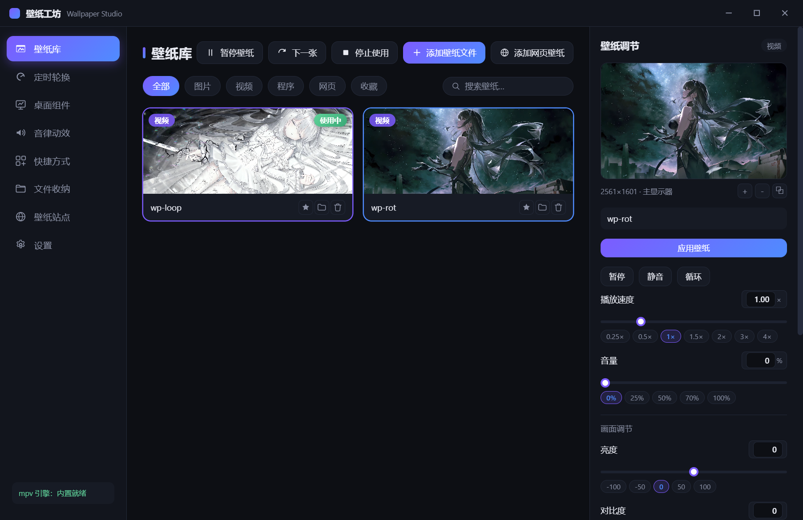
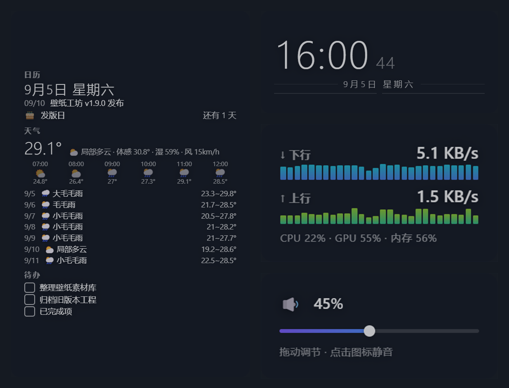
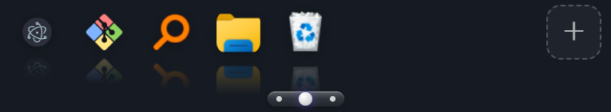
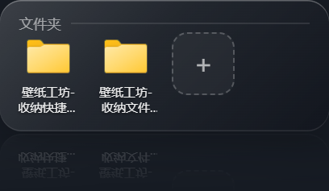

# 壁纸工坊 Wallpaper Studio

免费开源的 Windows 桌面壁纸软件 — 让桌面动起来。


## 官网

- **主站（Cloudflare Pages）**：<https://wallpaper-studio.pages.dev/>
- 备用（GitHub Pages）：<https://alinyu330.github.io/wallpaper-studio/>

## 下载

**最新版 v1.12.0 安装包**（Windows 10 / 11 · x64 · 约 280 MB · 内置全格式解码器 + 精选壁纸 · 更新数据三重保护）：

- 国内加速①：[gh-proxy.com 下载](https://gh-proxy.com/https://github.com/Alinyu330/wallpaper-studio/releases/download/v1.12.0/WallpaperStudio-Setup-1.12.0.exe)
- 国内加速②：[ghfast.top 下载](https://ghfast.top/https://github.com/Alinyu330/wallpaper-studio/releases/download/v1.12.0/WallpaperStudio-Setup-1.12.0.exe)
- GitHub 直连：[Releases 页面](https://github.com/Alinyu330/wallpaper-studio/releases)（含全部历史版本）

> 已安装旧版？客户端「设置 → 检查更新」即可应用内一键更新，无需重新下载安装包。

### 历史版本下载（全部版本，新 → 旧，安装包均已随 Release 发布）

| 版本 | 国内加速下载 | GitHub 直连 |
|---|---|---|
| v1.12.0 | [gh-proxy.com](https://gh-proxy.com/https://github.com/Alinyu330/wallpaper-studio/releases/download/v1.12.0/WallpaperStudio-Setup-1.12.0.exe) | [直连](https://github.com/Alinyu330/wallpaper-studio/releases/download/v1.12.0/WallpaperStudio-Setup-1.12.0.exe) |
| v1.11.0 | [gh-proxy.com](https://gh-proxy.com/https://github.com/Alinyu330/wallpaper-studio/releases/download/v1.11.0/WallpaperStudio-Setup-1.11.0.exe) | [直连](https://github.com/Alinyu330/wallpaper-studio/releases/download/v1.11.0/WallpaperStudio-Setup-1.11.0.exe) |
| v1.10.0 | [gh-proxy.com](https://gh-proxy.com/https://github.com/Alinyu330/wallpaper-studio/releases/download/v1.10.0/WallpaperStudio-Setup-1.10.0.exe) | [直连](https://github.com/Alinyu330/wallpaper-studio/releases/download/v1.10.0/WallpaperStudio-Setup-1.10.0.exe) |
| v1.9.0 | [gh-proxy.com](https://gh-proxy.com/https://github.com/Alinyu330/wallpaper-studio/releases/download/v1.9.0/WallpaperStudio-Setup-1.9.0.exe) | [直连](https://github.com/Alinyu330/wallpaper-studio/releases/download/v1.9.0/WallpaperStudio-Setup-1.9.0.exe) |
| v1.8.6 | [gh-proxy.com](https://gh-proxy.com/https://github.com/Alinyu330/wallpaper-studio/releases/download/v1.8.6/WallpaperStudio-Setup-1.8.6.exe) | [直连](https://github.com/Alinyu330/wallpaper-studio/releases/download/v1.8.6/WallpaperStudio-Setup-1.8.6.exe) |
| v1.8.5 | [gh-proxy.com](https://gh-proxy.com/https://github.com/Alinyu330/wallpaper-studio/releases/download/v1.8.5/WallpaperStudio-Setup-1.8.5.exe) | [直连](https://github.com/Alinyu330/wallpaper-studio/releases/download/v1.8.5/WallpaperStudio-Setup-1.8.5.exe) |
| v1.8.4 | [gh-proxy.com](https://gh-proxy.com/https://github.com/Alinyu330/wallpaper-studio/releases/download/v1.8.4/WallpaperStudio-Setup-1.8.4.exe) | [直连](https://github.com/Alinyu330/wallpaper-studio/releases/download/v1.8.4/WallpaperStudio-Setup-1.8.4.exe) |
| v1.8.3 | [gh-proxy.com](https://gh-proxy.com/https://github.com/Alinyu330/wallpaper-studio/releases/download/v1.8.3/WallpaperStudio-Setup-1.8.3.exe) | [直连](https://github.com/Alinyu330/wallpaper-studio/releases/download/v1.8.3/WallpaperStudio-Setup-1.8.3.exe) |
| v1.8.2 | [gh-proxy.com](https://gh-proxy.com/https://github.com/Alinyu330/wallpaper-studio/releases/download/v1.8.2/WallpaperStudio-Setup-1.8.2.exe) | [直连](https://github.com/Alinyu330/wallpaper-studio/releases/download/v1.8.2/WallpaperStudio-Setup-1.8.2.exe) |
| v1.8.1 | [gh-proxy.com](https://gh-proxy.com/https://github.com/Alinyu330/wallpaper-studio/releases/download/v1.8.1/WallpaperStudio-Setup-1.8.1.exe) | [直连](https://github.com/Alinyu330/wallpaper-studio/releases/download/v1.8.1/WallpaperStudio-Setup-1.8.1.exe) |
| v1.8.0 | [gh-proxy.com](https://gh-proxy.com/https://github.com/Alinyu330/wallpaper-studio/releases/download/v1.8.0/WallpaperStudio-Setup-1.8.0.exe) | [直连](https://github.com/Alinyu330/wallpaper-studio/releases/download/v1.8.0/WallpaperStudio-Setup-1.8.0.exe) |
| v1.7.1 | [gh-proxy.com](https://gh-proxy.com/https://github.com/Alinyu330/wallpaper-studio/releases/download/v1.7.1/WallpaperStudio-Setup-1.7.1.exe) | [直连](https://github.com/Alinyu330/wallpaper-studio/releases/download/v1.7.1/WallpaperStudio-Setup-1.7.1.exe) |
| v1.7.0 | [gh-proxy.com](https://gh-proxy.com/https://github.com/Alinyu330/wallpaper-studio/releases/download/v1.7.0/WallpaperStudio-Setup-1.7.0.exe) | [直连](https://github.com/Alinyu330/wallpaper-studio/releases/download/v1.7.0/WallpaperStudio-Setup-1.7.0.exe) |
| v1.6.0 | [gh-proxy.com](https://gh-proxy.com/https://github.com/Alinyu330/wallpaper-studio/releases/download/v1.6.0/WallpaperStudio-Setup-1.6.0.exe) | [直连](https://github.com/Alinyu330/wallpaper-studio/releases/download/v1.6.0/WallpaperStudio-Setup-1.6.0.exe) |
| v1.5.0 | [gh-proxy.com](https://gh-proxy.com/https://github.com/Alinyu330/wallpaper-studio/releases/download/v1.5.0/WallpaperStudio-Setup-1.5.0.exe) | [直连](https://github.com/Alinyu330/wallpaper-studio/releases/download/v1.5.0/WallpaperStudio-Setup-1.5.0.exe) |
| v1.4.0 | [gh-proxy.com](https://gh-proxy.com/https://github.com/Alinyu330/wallpaper-studio/releases/download/v1.4.0/WallpaperStudio-Setup-1.4.0.exe) | [直连](https://github.com/Alinyu330/wallpaper-studio/releases/download/v1.4.0/WallpaperStudio-Setup-1.4.0.exe) |
| v1.3.2 | [gh-proxy.com](https://gh-proxy.com/https://github.com/Alinyu330/wallpaper-studio/releases/download/v1.3.2/WallpaperStudio-Setup-1.3.2.exe) | [直连](https://github.com/Alinyu330/wallpaper-studio/releases/download/v1.3.2/WallpaperStudio-Setup-1.3.2.exe) |
| v1.3.1 | [gh-proxy.com](https://gh-proxy.com/https://github.com/Alinyu330/wallpaper-studio/releases/download/v1.3.1/WallpaperStudio-Setup-1.3.1.exe) | [直连](https://github.com/Alinyu330/wallpaper-studio/releases/download/v1.3.1/WallpaperStudio-Setup-1.3.1.exe) |
| v1.3.0 | [gh-proxy.com](https://gh-proxy.com/https://github.com/Alinyu330/wallpaper-studio/releases/download/v1.3.0/WallpaperStudio-Setup-1.3.0.exe) | [直连](https://github.com/Alinyu330/wallpaper-studio/releases/download/v1.3.0/WallpaperStudio-Setup-1.3.0.exe) |
| v1.2.0 | [gh-proxy.com](https://gh-proxy.com/https://github.com/Alinyu330/wallpaper-studio/releases/download/v1.2.0/WallpaperStudio-Setup-1.2.0.exe) | [直连](https://github.com/Alinyu330/wallpaper-studio/releases/download/v1.2.0/WallpaperStudio-Setup-1.2.0.exe) |
| v1.1.0 | [gh-proxy.com](https://gh-proxy.com/https://github.com/Alinyu330/wallpaper-studio/releases/download/v1.1.0/WallpaperStudio-Setup-1.1.0.exe) | [直连](https://github.com/Alinyu330/wallpaper-studio/releases/download/v1.1.0/WallpaperStudio-Setup-1.1.0.exe) |

> 各版本更新内容见下方「新增功能与修复问题」分节与 [官网更新日志](https://wallpaper-studio.pages.dev/#changelog)；更早版本（v1.0.0）见 [Releases 页面](https://github.com/Alinyu330/wallpaper-studio/releases)。

## v1.12.0 新增功能与修复问题

**新增功能**

- **更新数据三重保护**：升级 / 重装不再丢失任何用户数据 — 升级时自动跳过数据清理（--updated 守卫）、安装前自动备份配置与收纳内容、首次启动数据自愈核对；壁纸库、全部功能开关与数值参数、收纳的文件与快捷方式完整保留
- **收纳存储可见文件夹**：收纳的文件与快捷方式存放在应用根目录的「收纳快捷方式(卸载恢复)」「收纳文件(卸载恢复)」文件夹（默认为空、收纳时移入），位置公开透明、随时可查；设置页展示主存储 / 备用存储路径（点击直达所在文件夹）
- **收纳内容双保险镜像**：数据目录「收纳备份」实时镜像收纳内容 — 收纳时自动备份、恢复 / 移除时同步清理；主存储意外受损时，下次启动自动从镜像恢复，收纳与恢复功能不因单点受损失效

**修复问题**

- 修复更新版本后客户端收纳的快捷方式、文件无法恢复到桌面的问题（根因：NSIS 覆盖安装会静默运行旧版卸载器，旧逻辑误删全部数据目录；此后的每次升级均受保护）
- 修复更新版本后上传的壁纸从壁纸库消失、无法使用的问题（壁纸库索引随数据目录被误删所致，现完整保留）

## v1.11.0 新增功能与修复问题

**新增功能**

- **天气城市按 IP 自动定位**：信息看板天气开箱即显示所在地天气，无需手动设置；桌面看板点城市名或设置页搜索可手动指定（以手动为准），一键恢复自动定位

**修复问题**

- 修复桌面看板无法输入的问题 — 添加待办 / 日程、修改天气城市时打字无反应、中文输入法不弹出（三重根因均已修复）
- 修复看板编辑器卡住时删除按钮首次点击被吞的问题
- 修复任务栏 / 任务管理器中应用名显示为 Electron 的问题 — 正确显示为「壁纸工坊」

**优化**

- 看板输入框改为下划线式设计，与组件无边框融入壁纸的风格统一

## v1.10.0 新增功能与修复问题

**新增功能**

- **内置精选壁纸**：6 部精选动态壁纸随安装包附带（古风美女 · 初音未来 · 夏日绿树 · 圣诞夜 · 冬季雪林 · 大海云影），下载安装打开即可直接使用，无需自行寻找片源；已安装旧版升级不受影响
- **信息看板桌面直接编辑**：日程 / 待办直接在桌面看板上新增与删除，无需打开客户端；天气城市点击即可切换（常用城市一键选 + 全球城市搜索）

**修复问题**

- 修复桌面文件、快捷方式拖到转盘 / 收纳区「＋」附近无法收纳进去的问题
- 修复主文件夹、回收站、此电脑等系统图标无法收纳进快捷方式转盘的问题

**优化**

- 新用户首次开启各功能的默认位置与参数对齐实际使用习惯（组件位置、透明度、镜像模式、天气城市开箱即用少调整）

## 功能亮点

- **四类壁纸**：静态图片（JPG/PNG/BMP/WEBP/GIF）· 动态视频（MP4/AVI/MKV/FLV/WebM/MOV）· 网页（URL/本地 HTML）· EXE 程序

- **mpv 播放引擎**：全格式硬解直读，无需转码，内置完整解码器

- **内置精选壁纸**（v1.10.0 新增）：6 部精选动态壁纸随安装包附带（古风美女 / 初音未来 / 夏日绿树 / 圣诞夜 / 冬季雪林 / 大海云影），下载安装打开即可直接使用，已装旧版升级不受影响

- **桌面快捷方式转盘**（v1.5.0，v1.7.0/v1.8.0 增强）：快捷方式（.lnk/.url）与程序文件（.exe/.bat/.cmd）以转盘形式收纳在桌面（系统项：控制面板 / 回收站 / 网络 / 此电脑 亦可收纳）— 点击图标即可启动对应 App；按住图标条或拖动条左右拖动即可像转盘一样轮换（带惯性甩动）；拖动 ⋮ 手柄自由摆放位置；同屏数量 4~12 可调；图标取系统真实图标（无空白占位）、垂直倒影、去面板边框更沉浸；空闲自动收起为小药丸，悬停药丸展开，不遮挡窗口、不影响壁纸观感

- **桌面文件收纳区**（v1.8.0 新增，v1.9.0 重构）：桌面上的普通文件（办公文档 / 媒体 / 归档）与文件夹收进独立浮层，与快捷方式转盘职责分离 — 文件夹 / 文件自动分组排列（支持按名称 / 修改时间 / 手动排序），网格列数与面板透明度可调；文件名完整两行显示；空闲先转半透明毛玻璃、再收缩为单个文件图标，悬停自动展开、点击弹出收纳内容；面板镜像倒影与调色可调；收纳的文件移动隐藏（可一键恢复），文件夹仅登记引用不移动内容、点开即进入文件夹；支持自由拖动与九宫格快捷定位

- **应用内一键更新**（v1.8.1 新增）：检查更新发现新版本即弹出新版功能介绍窗口（更新日志直读发布页 Release Notes）；点「立即更新」在客户端内直接下载安装包（实时进度、可随时取消），下载完成自动静默安装并退出 — 全程无需跳转网页手动下载

- **音律动效**（v1.7.0，v1.9.0 重写）：系统音频实时频谱可视化，随音乐律动；绘制改为「离屏辉光层 + 两次合成」，每帧上百次高斯模糊填充降为 2 次图像合成，帧率可限（15/24/30/60/不限）；镜像倒影与主体同层绘制，彻底消除倒影区残影 / 撕裂；条形频谱 + 霓虹样式 + 渐变色、大小缩放、灵敏度调节，融入壁纸不突兀

- **桌面 DIY 组件**（v1.2.0，v1.7.0 重构，v1.9.0~v1.11.0 持续增强）：时钟（12/24 小时制点击切换）、信息看板（日历 / 天气按 IP 自动定位 / 待办，桌面直接编辑）、系统状态监控（网速 / CPU / GPU / 内存）、音量控制条、音律动效 — 每个组件独立小窗口，无边框融入壁纸；毛玻璃 / 液态玻璃样式与全局调色；新增「调整模式」：客户端一键进入拖动调整、桌面默认只显示不误触；组件 / 音律动效 / 转盘均支持九宫格快速定位与拖动吸附

- **点选 / 框选收纳**（v1.6.0，v1.7.0 增强）：全屏选择器直接点选或拖框选择桌面快捷方式，一键收纳进转盘 — 原桌面图标随之隐藏（实际移动文件到应用数据目录保管）；支持回收站、此电脑等系统项收纳与过滤无效文件；从转盘移除、一键"全部恢复"或关闭功能时，自动移回桌面原位置（恢复显示）

- **平滑循环过渡 2.0**（v1.5.0，v1.9.0 平滑升级）：循环交界处新画面柔和淡入覆盖（旧画面保持不透明垫底），亮度恒定、无黑变无重影；smoothstep 缓动曲线，过渡如行云流水；定时轮换提前 3 秒预热解码器，到点立即开始溶解；待命槽提前重建，压缩循环交界的定格停顿；关闭平滑循环改为硬切循环（不再播一遍就冻在末帧）

- **循环无感升级**（v1.6.0）：只在视频结尾定格后开始溶解（静止帧叠加，肉眼无感）；结尾 70ms 高频轮询 + 淡入 33ms 专用步进，定格停顿压缩到 0.1s 级、淡入 \~30fps 平滑无跳变，长时间循环稳定如一

- **参数精确调节**：播放速度（0.25×–4×）、音量、亮度、对比度、饱和度；每项参数均有固定调整点一键跳转 + 数值精确输入

- **实时预览**：按主显示器真实比例预览；预览区可放大缩小；支持弹出独立预览窗口，参数实时同步

- **壁纸暂停**（v1.2.0）：一键暂停视频播放与轮换，恢复桌面清爽；支持托盘操作，重启后保持状态

- **多壁纸定时轮换**（v1.2.0）：全部/收藏/自定义列表三种范围，随机或顺序切换，间隔自由设定，工具栏一键"下一张"

- **壁纸站点导航**（v1.3.0 扩充）：内置 4K Desk、TooPIC、好壁纸、魔玉部落、Wallhaven、必应壁纸、Unsplash 等 13 个热门免费壁纸站点，点击直达

- **智能自动暂停**（v1.3.0）：全屏应用 / 笔记本电池供电 / 其他窗口最大化（Wallpaper Engine 同款）三种场景自动暂停视频壁纸省电省资源，条件解除自动恢复

- **全局快捷键**（v1.3.0）：Ctrl+Alt+W 一键暂停/恢复壁纸，游戏或任意界面可用，可开关

- **停止使用壁纸**（v1.3.0）：一键停用当前壁纸恢复系统默认桌面，壁纸库记录保留

- **深度性能优化**：GPU 硬解 · 性能档位（省电/均衡/性能）· 渲染分辨率限制（原生/1080P/720P/480P）· 渲染质量三档 · 视频帧率上限

- **桌面与锁屏**：壁纸嵌入系统 WorkerW 层（图标层之下），多显示器铺满；图片壁纸一键同步为 Windows 锁屏背景

- **无黑屏自愈**（v1.5.0 完整生效）：播放卡死/暂停脱节时，备用引擎先在冻结画面上方渲染出画面再替换旧进程——全程无黑屏、不打断使用；结尾定格僵死、时长未知等边缘场景均有兜底修复

- **播放健康检查**（v1.3.2）：渲染冻结/暂停状态脱节自动检测恢复，引擎事件日志（`engine.log`）可回溯定位

- **壁纸管理**：收藏 · 搜索 · 类型筛选 · 双击应用 · 托盘常驻

- **稳定看门狗**：壁纸窗口丢失自动恢复、桌面层级变化自动重挂载、mpv 进程异常退出自动重启、窗口操作隔离执行器（目标窗口冻结时主进程永不阻塞，队列化派发不误伤合法操作）

## 软件效果截图

| 主控界面 | 桌面组件 |
| --- | --- |
|  |  |
| **快捷方式转盘** | **文件收纳区** |
|  |  |

## 下载历史版本

前往 [Releases](https://github.com/Alinyu330/wallpaper-studio/releases) 下载历史版本安装包；官网底部「更新日志」有每个版本的完整变更说明。

## 开发

```bash
npm install     # 安装依赖（含 koffi、electron、electron-builder）
npm run get-mpv # 下载 mpv 播放器到 assets/mpv/（首次必做，仓库不含该二进制）
npm start       # 开发运行
npm run build   # 生成 Windows 安装包（dist/ 目录）
```

### 技术栈

- [Electron](https://www.electronjs.org/) — 应用框架

- [koffi](https://koffi.dev/) — Win32 API 调用（窗口嵌入/层级管理）

- [mpv](https://mpv.io/) — 视频播放内核（assets/mpv 内置）

### 目录结构

```
├── main.js               # 主进程：窗口/壁纸引擎调度/IPC/托盘/组件窗口/轮换/转盘
├── preload-main.js       # 主界面桥接
├── preload-wallpaper.js  # 壁纸窗口桥接
├── preload-preview.js    # 预览弹窗桥接
├── preload-widgets.js    # 桌面组件窗口桥接
├── preload-launcher.js   # 快捷方式转盘窗口桥接
├── src/
│   ├── desktop.js        # 桌面嵌入（WorkerW 挂载/全屏与最大化检测/多显示器/窗口移动）
│   ├── mpv.js            # mpv 播放控制器（IPC/参数/分辨率限制/进程竞态防护）
│   ├── video-engine.js   # 双槽视频引擎（淡入覆盖循环/无黑屏自愈/健康检查）
│   ├── win-ops.js        # 窗口操作隔离执行器（worker 线程池/队列化派发/超时保护）
│   ├── launcher.js       # 桌面快捷方式转盘宿主（图标层之上覆盖窗口）
│   ├── widgets-host.js   # 桌面组件独立窗口宿主（时钟/监控/音量/音律动效，每组件一窗口）
│   ├── icons.js          # 快捷方式图标解析（EXE/LNK/系统项 → PNG，icon-extract.ps1）
│   ├── exe-wallpaper.js  # EXE 壁纸嵌入控制器
│   ├── lockscreen.js     # 锁屏壁纸（PersonalizationCSP）
│   ├── widgets-stats.js  # 系统信息采集（CPU/GPU/内存，PDH 计数器）
│   ├── updater.js        # 版本更新检查
│   ├── store.js          # 配置持久化
│   └── file-types.js     # 文件类型识别
├── renderer/             # 界面（主界面/壁纸窗口/预览弹窗/组件窗口/转盘窗口/选择器窗口）
├── assets/mpv/           # mpv 播放器（npm run get-mpv 下载，不入库）
├── scripts/              # 辅助脚本（mpv 下载）
└── docs/                 # 官网（GitHub Pages）
```

## License

MIT
